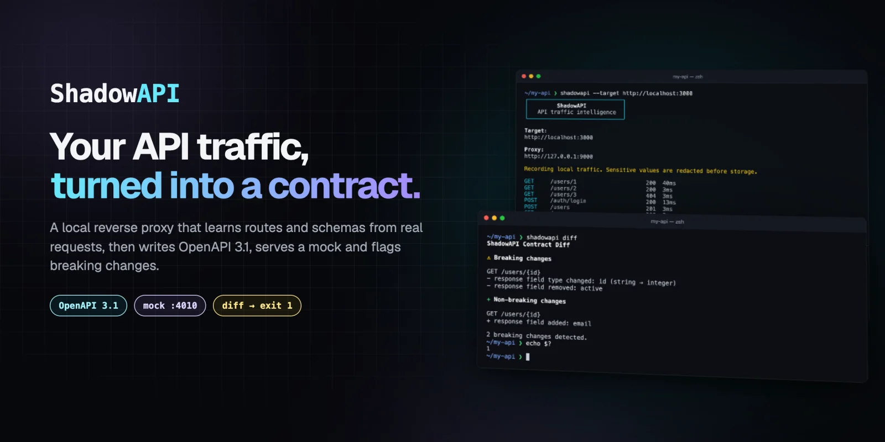
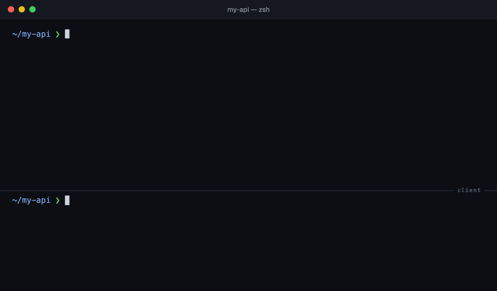
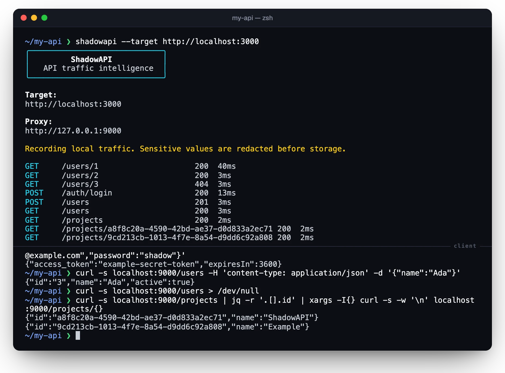
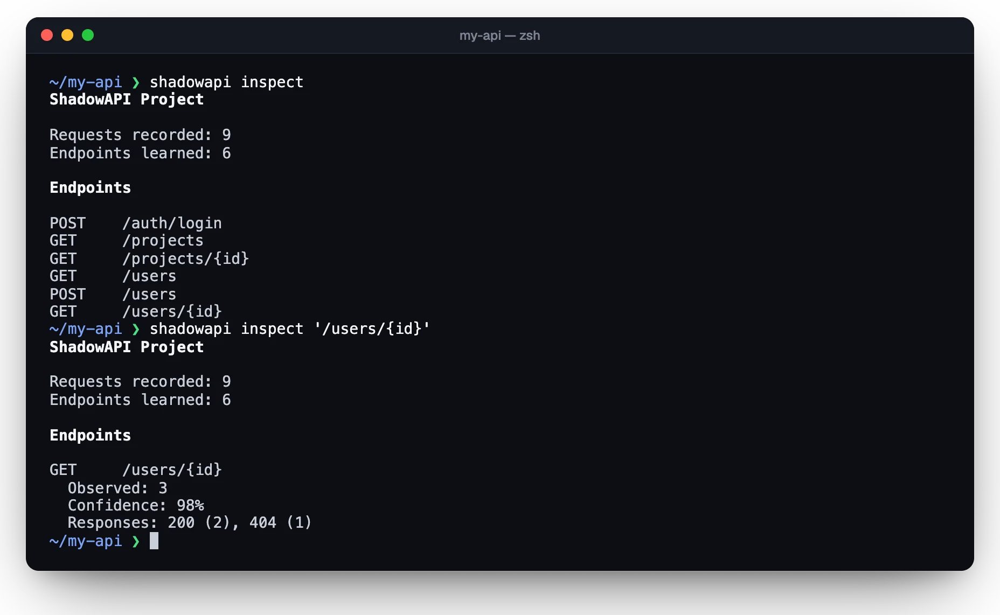
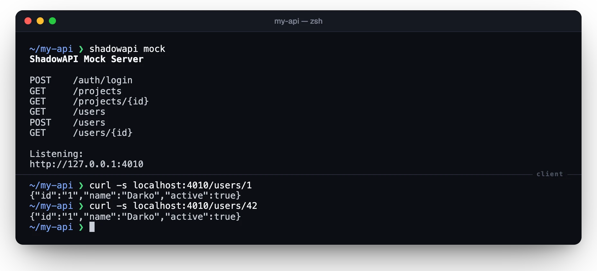
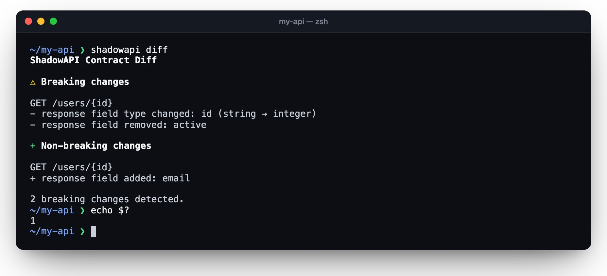
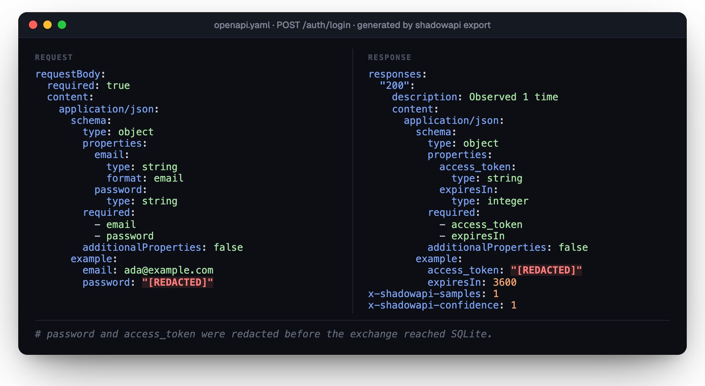

<p align="center">
  
</p>

<p align="center">
  <a href="https://github.com/darkooom/ShadowAPI/actions/workflows/ci.yml"></a>
  <a href="https://www.npmjs.com/package/@darkooom/shadowapi"></a>
  <a href="https://nodejs.org/"></a>
  <a href="LICENSE"></a>
</p>

<p align="center">
  <a href="#quick-start"><b>Quick start</b></a>
  &nbsp;·&nbsp;
  <a href="#generate-openapi-31"><b>OpenAPI</b></a>
  &nbsp;·&nbsp;
  <a href="#run-the-learned-mock"><b>Mock</b></a>
  &nbsp;·&nbsp;
  <a href="#detect-contract-changes"><b>Diff</b></a>
  &nbsp;·&nbsp;
  <a href="docs/architecture.md"><b>Architecture</b></a>
</p>

<br>

**Turn observed HTTP traffic into an OpenAPI 3.1 contract, a local mock server, and actionable contract diffs.**

ShadowAPI is a local-first reverse proxy. Point a client at it, exercise an API, and let deterministic inference learn routes, request/response schemas, status codes, and examples—without annotations or SDK instrumentation.

<p align="center">
  
</p>

<p align="center"><sub>Real output from the <code>shadowapi</code> CLI against the bundled synthetic example API: proxy, inspect, export, snapshot, mock, and a breaking-change diff.</sub></p>

> [!WARNING]
> ShadowAPI records HTTP bodies. Use only traffic you are authorized to inspect. Common credentials and secret fields are redacted before persistence, but no heuristic can identify every secret. Review [Security and privacy](#security-and-privacy) before using sensitive systems.

## Why ShadowAPI?

- **Runtime evidence, not stale annotations.** Contracts are inferred from requests and responses that actually occurred.
- **One observation loop, three outputs.** Export OpenAPI, replay learned responses, and detect breaking changes from the same local capture.
- **Local and deterministic.** Traffic, SQLite state, inference, mocks, and diffs stay on your machine; there is no account, telemetry, cloud service, or AI call.
- **Conservative inference.** Dynamic path segments, optional fields, nullability, formats, and low-cardinality enums are learned without turning arbitrary IDs or names into constraints.
- **Composable internals.** Proxying, recording, storage, inference, OpenAPI generation, mocking, and diffing remain separate packages.

## How it works

<picture>
  <source media="(prefers-color-scheme: dark)" srcset="assets/readme/pipeline-dark.webp">
  
</picture>

Each stage is its own package; see [Architecture](docs/architecture.md) for the boundaries and data flow.

## Route learning in one glance

<picture>
  <source media="(prefers-color-scheme: dark)" srcset="assets/readme/routes-dark.webp">
  
</picture>

Integers, UUIDs, ULIDs, ObjectIds, hashes, timestamps, and nanoid-like segments become path parameters; known static routes such as `/users/me` remain separate.

## Quick start

ShadowAPI requires Node.js 22 or newer. Run it without installing:

```bash
npx @darkooom/shadowapi --target http://localhost:3000
```

Or install the CLI globally:

```bash
npm install --global @darkooom/shadowapi
shadowapi --target http://localhost:3000
```

Then point your client at `http://localhost:9000` and exercise the API you want to learn.

<p align="center">
  
</p>

### Develop from source

The monorepo uses pnpm through Corepack:

```bash
corepack enable
pnpm install --frozen-lockfile
pnpm build
```

Start the bundled example API:

```bash
pnpm example
```

In another terminal, start ShadowAPI and send traffic through port `9000`:

```bash
pnpm shadowapi --target http://localhost:3000
curl http://localhost:9000/users/1
curl http://localhost:9000/users/2
```

Local observations are stored in the ignored `.shadowapi/` directory.

## Generate OpenAPI 3.1

```bash
pnpm shadowapi inspect
pnpm shadowapi export
```

<p align="center">
  
</p>

The inferred response schema is based on merged observations:

```yaml
type: object
properties:
  id:
    type: string
  name:
    type: string
  active:
    type: boolean
  avatar:
    type: string
    format: uri
required: [id, name, active]
```

See the deliberately synthetic [generated example](examples/generated/openapi.yaml).

## Run the learned mock

Stop the proxy, then start the mock server:

```bash
pnpm shadowapi mock
curl -i http://localhost:4010/users/1
```

<p align="center">
  
</p>

Exact recorded requests replay their observed response. Other requests matching a learned normalized route receive a representative compatible response.

## Detect contract changes

Create a baseline, exercise the changed API through the proxy, then compare:

```bash
pnpm shadowapi snapshot
# generate fresh traffic against the changed API
pnpm shadowapi diff
```

<p align="center">
  
</p>

`diff` reports response-field removals, incompatible type changes, required request changes, response status changes, enum changes, and endpoint additions. Exit codes are `0` for no breaking changes, `1` for breaking changes, and `2` for execution errors.

Only endpoints observed after the snapshot replace their baseline definitions. Unobserved baseline endpoints remain unchanged because missing traffic is not evidence that an endpoint was removed.

## Commands

| Command                                                  | Purpose                                 |
| -------------------------------------------------------- | --------------------------------------- |
| `shadowapi --target <url>`                               | Convenience form of `proxy`             |
| `shadowapi proxy --target <url> [--port 9000]`           | Observe proxied traffic                 |
| `shadowapi proxy --no-store`                             | Forward without persisting observations |
| `shadowapi inspect [path]`                               | Summarize the learned model             |
| `shadowapi export [--format yaml\|json] [--output path]` | Generate OpenAPI 3.1                    |
| `shadowapi mock [--port 4010]`                           | Replay learned responses                |
| `shadowapi snapshot`                                     | Save the current normalized contract    |
| `shadowapi diff`                                         | Compare post-snapshot observations      |
| `shadowapi reset --yes`                                  | Delete local observations and snapshots |

Global options include `--config <path>` and `--verbose`.

## Configuration

Copy [shadowapi.config.example.ts](shadowapi.config.example.ts) to `shadowapi.config.ts` and adjust it for the target API. Configuration supports proxy/mock ports, ignored paths, capture limits, redacted headers and fields, and conservative enum thresholds.

## Repository structure

```text
apps/cli/                 CLI entrypoint and package
packages/shared/          Shared contracts and interfaces
packages/proxy/           Reverse proxy transport
packages/recorder/        Capture redaction and limits
packages/storage/         SQLite/Drizzle persistence
packages/inference/       Route and JSON Schema inference
packages/openapi/         OpenAPI 3.1 rendering
packages/mock/            Learned response server
packages/diff/            Contract comparison
packages/core/            Project orchestration
examples/express-api/     Synthetic API for local E2E testing
examples/generated/       Deliberate generated artifacts
docs/                     Architecture and roadmap
```

See [Architecture](docs/architecture.md) for package boundaries and data flow.

## Security and privacy

<p align="center">
  
</p>

- Redaction happens before captured exchanges are persisted.
- Default redaction covers common credential headers and JSON field names.
- Binary captures are size-limited and represented explicitly.
- Proxy and mock servers bind to loopback by default.
- `.shadowapi/`, SQLite databases, HAR files, and local OpenAPI output are ignored by Git.

In the demo run, the example API's login token was not persisted: the exported contract shows `[REDACTED]`, and a search for the token string under `.shadowapi/` finds nothing.

Redaction is defense in depth, not a guarantee. Avoid production traffic unless you have reviewed the configuration and data-handling implications. Report vulnerabilities privately as described in [SECURITY.md](SECURITY.md).

## Project status

ShadowAPI `0.1.0` is the first public release and is available as [`@darkooom/shadowapi`](https://www.npmjs.com/package/@darkooom/shadowapi). The implemented surface and planned work are tracked separately in the [roadmap](docs/roadmap.md) and [changelog](CHANGELOG.md).

The README visuals are captured from real CLI runs against the synthetic example API; [assets/README.md](assets/README.md) documents how they were made. There is no project logo yet.

## Contributing

Read [CONTRIBUTING.md](CONTRIBUTING.md) before submitting a change. Never commit real traffic, `.shadowapi` state, credentials, cookies, tokens, or personal data.

Participation is governed by the [Code of Conduct](CODE_OF_CONDUCT.md).

## License

Apache License 2.0. See [LICENSE](LICENSE).
